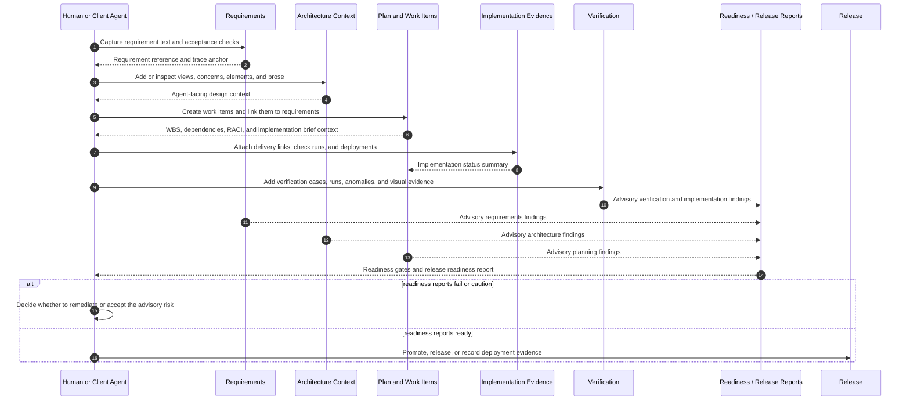
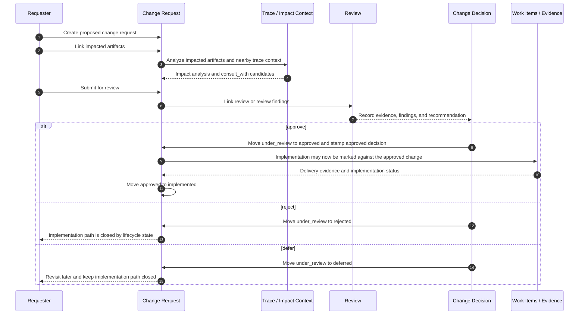
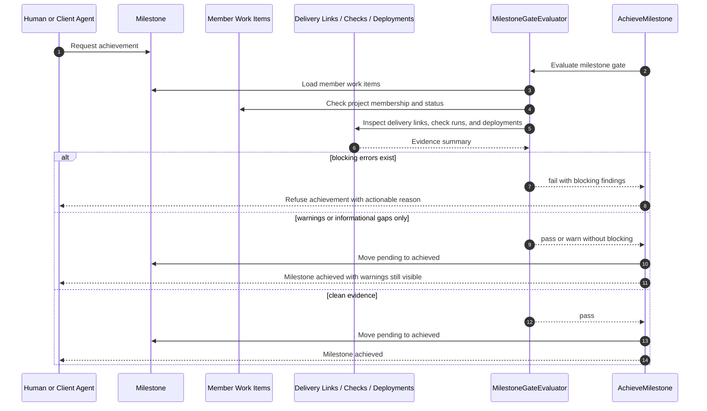

# Governance Data Flow Tiers

This page is a descriptive map of how captured Growth data is consumed. It is
not a new source of truth, a gate definition, or an implementation contract. The
source of truth remains the model, transition, linter, readiness, trace, MCP
resource, and manifest code.

The first cut is intentionally hand-authored Mermaid in docs. It exists to make
the data-usage audit from #395 reviewable at a glance, after the follow-up
decisions in #396 and #402. Generated diagrams may make sense later for stable
registries such as transition classes, readiness gate IDs, linter sections, and
Capability sections. This slice adds no webapp panel and no MCP rendering
surface.

## Tier Vocabulary

Growth's captured data falls into four consumer tiers:

| Tier | Meaning | Typical consumer |
| --- | --- | --- |
| T0 Enforced | A supported write path can be blocked. | Lifecycle transition preconditions and state machines |
| T1 Advisory | A report, gate, linter, scanner, or brief changes what a human or Client Agent should do, but does not block by itself. | Readiness gates, linters, release readiness, contradiction scans |
| T2 Structural / Navigation | The data shapes trace, search, resources, manifests, docs, queues, or context bundles. | Trace graph, search, MCP resources, manifest import/export, artifact briefs |
| T3 Documentation / Context | The data is retained as explanatory or design context. It may be useful to read, but Growth does not judge it directly. | Prose, descriptions, narrative fields, source bodies |

## Data-Consumer Map

```mermaid
flowchart LR
    subgraph Captured["Captured project data"]
        WI["Work items\nstatus, dependencies, RACI"]
        Evidence["Delivery evidence\nlinks, checks, deployments"]
        Milestones["Milestones"]
        Req["Requirements\ntext, acceptance, priority, rationale"]
        Arch["Architecture\nviews, concerns, elements, prose, properties"]
        Tests["Verification\ntest plans, cases, runs, anomalies"]
        Plan["Planning\nPMP, WBS, roles, risks, baselines"]
        Reviews["Reviews\nplans, participants, findings, decisions"]
        Changes["Change requests\nimpacts, rationale, lifecycle"]
        Mockups["Mockups"]
        Raci["RACI assignments\nR, A, C, I"]
        TraceData["Citations, sources,\nstakeholders, artifact links"]
        Decisions["Decision requests"]
    end

    subgraph T0["T0 enforced: can block a supported write path"]
        MilestoneGate["Milestone gate\nAchieveMilestone precondition"]
        ChangeState["Change request state machine\napproval before implementation"]
    end

    subgraph T1["T1 advisory: reports, gates, scanners, and lint"]
        Readiness["Readiness gates\nrequirements, architecture, verification,\nplanning, review, change control, implementation"]
        Linters["Linters\nRequirement, Design, Test, PMP,\nReview, Change, Baseline"]
        ReleaseReadiness["Release readiness report"]
        Contradictions["Contradiction scanner"]
    end

    subgraph T2["T2 structural / navigation: graph, search, docs, context"]
        Trace["Trace graph and trace-query"]
        Search["Search"]
        Resources["MCP resources and dashboard surfaces"]
        Manifest["apply-manifest / export-manifest"]
        Briefs["Artifact brief resources\nimplementation, mockup design,\nverification, review, change impact"]
        Queue["My queue and notifications"]
    end

    subgraph T3["T3 documentation / context: retained for reading"]
        SDD["SRS / SDD / PMP / evidence docs"]
        Prose["Narrative context\nrationale, descriptions, source bodies,\narchitecture prose, element properties"]
    end

    WI --> MilestoneGate
    Evidence --> MilestoneGate
    Milestones --> MilestoneGate
    Changes --> ChangeState

    Req --> Readiness
    Arch --> Readiness
    Tests --> Readiness
    Plan --> Readiness
    Reviews --> Readiness
    Changes --> Readiness
    Evidence --> Readiness

    Req --> Linters
    Arch --> Linters
    Tests --> Linters
    Plan --> Linters
    Reviews --> Linters
    Changes --> Linters

    Readiness --> ReleaseReadiness
    Plan --> ReleaseReadiness
    Evidence --> ReleaseReadiness
    WI --> Contradictions
    Tests --> Contradictions
    Evidence --> Contradictions
    Changes --> Contradictions

    Req --> Trace
    Arch --> Trace
    Tests --> Trace
    Plan --> Trace
    Reviews --> Trace
    Changes --> Trace
    Raci --> Trace
    TraceData --> Trace

    Req --> Search
    Arch --> Search
    Plan --> Search
    TraceData --> Search

    Req --> Resources
    Arch --> Resources
    Tests --> Resources
    Plan --> Resources
    Reviews --> Resources
    Changes --> Resources
    Evidence --> Resources

    Req --> Manifest
    Arch --> Manifest
    Plan --> Manifest
    Tests --> Manifest
    TraceData --> Manifest

    WI --> Briefs
    Req --> Briefs
    Arch --> Briefs
    Tests --> Briefs
    Reviews --> Briefs
    Changes --> Briefs
    Mockups --> Briefs
    Evidence --> Briefs
    Raci --> Briefs

    Raci --> Queue
    Decisions --> Queue
    Changes --> Queue
    Reviews --> Queue
    WI --> Queue

    Req --> SDD
    Arch --> SDD
    Tests --> SDD
    Plan --> SDD
    Evidence --> SDD
    TraceData --> SDD

    Req --> Prose
    Arch --> Prose
    Plan --> Prose
    Reviews --> Prose
    Changes --> Prose
    TraceData --> Prose
```

## Current Reading

### T0: Enforced

The milestone gate is the hard data-content gate. `AchieveMilestone` refuses the
transition when a milestone has no member work items, member work is not done,
member work belongs to another project, or done member work has failed,
timed-out, or action-required checks. Done work without delivery evidence is
reported as a warning or informational adoption gap, not a hard block.

Change-request implementation is also lifecycle-enforced, but by state-machine
reachability rather than an extra content precondition. A change request can only
move to `implemented` from `approved`, and `approved` is produced by the approval
transition that records an approved decision.

### T1: Advisory

Readiness gates, release readiness, linters, and the contradiction scanner shape
decisions without blocking most lifecycle operations. A readiness `fail` is a
real signal for dashboards, MCP tools, resources, evidence bundles, and prompts,
but #398 still owns the product decision about which readiness failures should
become transition blockers.

The contradiction scanner is deliberately report-only. It detects states such as
done work against open severe anomalies or deployed failed checks. Some findings
may be defense-in-depth for states that supported write paths already prevent;
others are post-hoc warnings about states the current gates do not block.

### T2: Structural / Navigation

The trace graph, search, project resources, manifest round-trip, dashboard
surfaces, queues, notifications, and artifact brief resources are structural
consumers. They make data navigable and put it in front of humans or Client
Agents at the moment it can affect work.

Issue #396 moved architecture content into this tier as agent-facing design
context. Architecture prose, element properties, concerns, and views are not
treated as free-text gate conditions, but they are deliberately surfaced in
planning, implementation, review, mockup, verification, and change-impact
briefs.

Issue #402 moved RACI `Consulted` out of captured-only status. `Responsible` and
`Accountable` route blocked work ownership, `Informed` receives status-change
notifications, and `Consulted` appears as `consult_with` context on blocked work,
decision-request, and change-impact surfaces.

### T3: Documentation / Context

Some fields are intentionally explanatory. Requirement rationale, architecture
prose, element properties, source bodies, review discussion, and change-request
narrative can help a human or Client Agent understand the work. Growth may serve
that context, but it does not judge arbitrary prose quality as a gate.

This tier should stay honest: if a field is neither read, surfaced at the right
moment, nor expected to inform a human or Client Agent, it is ceremony and should
be wired into a consumer or removed in a follow-up issue.

## Lifecycle Sequence Diagrams

These sequence diagrams use the same tier vocabulary as the data-consumer map.
They are descriptive: they explain current supported flows and decision points,
but they do not define new behavior.

### Requirement To Release Lifecycle

Readiness in this sequence is advisory unless a separate transition explicitly
uses it as a precondition. Issue #398 owns the decision about which readiness
failures should become enforced.

### Change Request Review And Implementation Lifecycle

The approved-before-implemented rule is enforced by lifecycle state reachability:
`implemented` is only reachable from `approved`, and `approved` is produced by
the approval transition.

### Milestone Achievement Gate Lifecycle

This is the hard data-content gate currently shown in the tier map. Blocking
errors stop the supported transition. Warning and informational evidence gaps
remain visible but do not stop milestone achievement.

## Open Follow-Ups

- #398 decides which readiness gate failures, if any, should become enforced
  transition blockers.
- Future diagram work may add rigor-level or role/profile diagrams.
